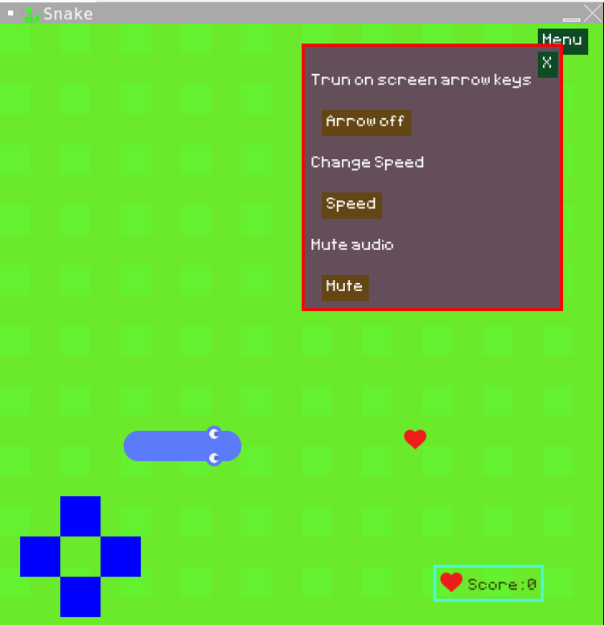
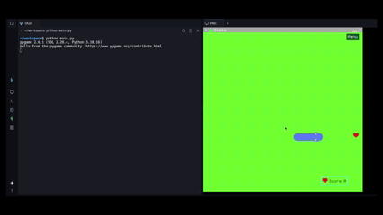

# Snake Game Made with Python [Pygame]

# For SOM Admin: You can click this releases to download zip file: https://github.com/thienvann12924/Snack-Game/releases/tag/v1.0/SnakeGame.zip

**Welcome to the Snake Game!** 🐍🎮

Enjoy the classic Snake Game implemented in Python using the Pygame library. Control a growing snake as it navigates the game board, eating food and avoiding collisions. Customize game settings, challenge your reflexes, and have fun with this timeless arcade game.

## Table of Contents

- [Features](#features)
- [Installation](#installation)
- [Usage](#usage)
- [Configuration](#configuration)

## Features

- **Menu Panel**: Accessible after clicking the menu button.
- **Control Options**: Move the snake using keyboard arrow keys or by turning on-screen keys from the menu.
- **Audio Control**: Mute the game audio from the menu.
- **Adjustable Speed**: Increase the snake's speed from the menu.
- **User-Friendly Interface**: Clear and intuitive menu panel.
- **Enjoyable Gameplay**: Classic snake game mechanics with customizable settings.




- **Python**: A high-level programming language.
- **Pygame**: A set of Python modules designed for writing video games.

## Installation

### Prerequisites

- **Python**: Ensure Python is installed on your system.
- **Pygame**: Install the Pygame library.

### Steps to Install

1. Clone the repository.

2. Install Pygame First:

   ```sh
   pip install pygame
   ```

### Running the Game

1. Execute the `main.py` file:

   ```sh
   python main.py
   ```

2. Alternatively, you can play the game on Replit:

   [Play on Replit](https://replit.com/@witraf/Snake-Game)

## SUMMARY: IN TERMINAL: 1: "pip install pygame"; 2: run "python main.py".

## Usage

- **Menu Panel**: Click the menu button to access various game settings.
- **Move the Snake**: Use the keyboard arrow keys or enable on-screen keys from the menu.
- **Mute Audio**: Mute the game audio through the menu.
- **Adjust Speed**: Increase the snake's speed from the menu settings.

## Configuration

### Menu Settings

- **Control Options**: Choose between keyboard arrow keys or on-screen keys for controlling the snake.
- **Audio Control**: Enable or mute the game audio.
- **Speed Adjustment**: Modify the speed of the snake to increase the game's difficulty.

---

Thank you for playing the Snake Game! We hope you enjoy it and find it both fun and challenging.
